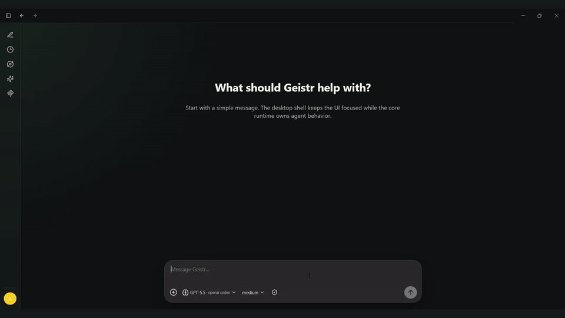

# Geistr Core

Geistr Core is a reusable desktop-first AI app foundation. You can run it as a polished local AI workspace today, or use it as the base layer for building your own agent app, research workspace, tutor, coding assistant, creative tool, or internal automation product.

The core idea is simple: the hard parts of a modern desktop agent app should already be done once — chat, sessions, providers, tools, permissions, memory, skills, MCP, background workflows, settings, packaging, and good UI rendering — so your next app can focus on its domain instead of rebuilding the foundation.

## Why I built this

I always have ideas for specific-use-case AI apps, and every time I started one I found myself rebuilding the same core pieces from scratch.

So I asked myself: **why don't I have a core app that already gives me the things I always need, so I can build on top of it?**

That is why I created Geistr Core for my own use: a base app I can reuse whenever I want to build a focused AI product. I am releasing it as open source for anyone who has a good idea and wants to build it without spending weeks recreating the foundation first.

Use this to save time, start closer to your real idea, and focus on the specific experience you want to create.



## What you get out of the box

- **Desktop app shell** — Electron + React app with chat, sidebar navigation, settings, themes, attachments, and packaged builds.
- **Pi SDK agent runtime** — Geistr wraps [Pi SDK / `@earendil-works/pi-coding-agent`](https://www.npmjs.com/package/@earendil-works/pi-coding-agent) and [`@earendil-works/pi-ai`](https://www.npmjs.com/package/@earendil-works/pi-ai) instead of rebuilding agent/session/model infrastructure.
- **Many providers** — provider/model selection, thinking-level controls, API-key auth, and subscription/OAuth-style provider support where available.
- **Persistent local sessions** — SQLite-backed chat sessions, event history, attachments, and runtime context assembly.
- **Memory** — memory indexing, retrieval into prompts, read/write memory tools, and a Memory Galaxy graph UI.
- **Provider-independent web access** — built-in `web_search` and `web_fetch` tools exposed through Geistr names, not tied to the selected model provider.
- **Skills** — installed skill catalog, compact prompt listing, and read-only `skill_load` tool for loading full skill instructions on demand.
- **MCP servers** — STDIO and Streamable HTTP MCP support with controlled tool exposure.
- **Permission modes** — four app-level access modes: Read only, Request approval, Default, and Full access.
- **Rich chat rendering** — streaming assistant responses, thinking/tool activity visibility, approval cards, attachments, markdown rendering, and loop progress.
- **Background loops** — reusable workflow runtime for compaction, background tasks, validators, artifacts, retries, progress, and agent-triggered jobs.
- **Packaging flow** — local `electron-builder` packaging for desktop distribution experiments.

## The core architecture

Geistr Core separates reusable agent-app infrastructure from the app you build on top.

```txt
apps/desktop/              Electron + React desktop app
packages/core/             Reusable Geistr Core runtime and app systems
docs/                      Architecture, feature, and extension docs
.agents/skills/            Project workflow skills for agent-assisted development
scripts/                   Repo maintenance scripts
```

The desktop app owns UI, IPC, windows, local settings screens, and visual presentation. `packages/core` owns reusable systems: Pi SDK integration, provider/model selection, prompt assembly, tools, permissions, memory, skills, MCP, loops, artifacts, and persistence seams.

That gives you a practical split:

- build a new product by changing UI, prompts, skills, loops, and domain tools;
- keep the core runtime stable;
- avoid duplicating Pi SDK wiring in every screen;
- let agents read local docs and understand how to extend the app safely.

Start with the architecture docs:

- [`docs/architecture/architecture.md`](docs/architecture/architecture.md)
- [`docs/architecture/desktop-shell.md`](docs/architecture/desktop-shell.md)
- [`docs/core/core-agent-runtime.md`](docs/core/core-agent-runtime.md)
- [`docs/core/session-persistence.md`](docs/core/session-persistence.md)

## Stack

- **Runtime/package manager:** [Bun](https://bun.sh/)
- **Desktop:** [Electron](https://www.electronjs.org/)
- **Renderer:** [React](https://react.dev/) + TypeScript + Vite
- **Agent runtime:** [Pi SDK / `@earendil-works/pi-coding-agent`](https://www.npmjs.com/package/@earendil-works/pi-coding-agent)
- **Model/provider layer:** [`@earendil-works/pi-ai`](https://www.npmjs.com/package/@earendil-works/pi-ai)
- **MCP:** [`@modelcontextprotocol/sdk`](https://www.npmjs.com/package/@modelcontextprotocol/sdk)
- **Local persistence:** SQLite-backed session storage
- **Packaging:** [electron-builder](https://www.electron.build/)
- **Tests:** Vitest + Testing Library

## Pi SDK relationship

Geistr Core uses Pi SDK as the foundation for sessions, models, auth, tools, context, and agent behavior. The app does not try to replace Pi. Instead, it wraps Pi behind stable Geistr seams so the desktop app can stay focused on product behavior and UI.

Useful docs:

- [`docs/roles/pi-sdk.md`](docs/roles/pi-sdk.md)
- [`docs/core/core-agent-runtime.md`](docs/core/core-agent-runtime.md)
- [`docs/core/provider-model-selection.md`](docs/core/provider-model-selection.md)
- [`docs/core/settings-provider-auth.md`](docs/core/settings-provider-auth.md)

## Memory

Geistr includes a local memory system for indexing useful session content, retrieving relevant memories into future prompts, and letting the agent read/write memories through controlled tools.

It also includes a read-only **Memory Galaxy** UI for exploring memories as a graph.


Docs:

- [`docs/loops/memory-tools.md`](docs/loops/memory-tools.md)
- [`docs/core/memory-galaxy.md`](docs/core/memory-galaxy.md)
- [`docs/core/session-persistence.md`](docs/core/session-persistence.md)

## Web search and fetch

Geistr includes provider-independent web tools:

- `web_search` — search the public web
- `web_fetch` — fetch and read a URL

These tools are exposed as Geistr tools and are not dependent on whichever model provider the user selects. The current adapter uses Exa MCP internally, but the agent sees stable Geistr tool names.

Docs:

- [`docs/core/web-tools.md`](docs/core/web-tools.md)
- [`docs/skills-mcp/mcp-servers.md`](docs/skills-mcp/mcp-servers.md)

## Skills and MCP

Skills give agents operational instructions without injecting every instruction into every prompt. The runtime lists active skills compactly, and the agent can call `skill_load` when it needs the full instructions.

MCP support lets the app expose external tools through STDIO or Streamable HTTP servers while still routing them through Geistr's permission and runtime model.

Docs:

- [`docs/skills-mcp/skills.md`](docs/skills-mcp/skills.md)
- [`docs/skills-mcp/mcp-servers.md`](docs/skills-mcp/mcp-servers.md)
- [`docs/roles/skills.md`](docs/roles/skills.md)
- [`docs/roles/tools.md`](docs/roles/tools.md)

## Permission modes

Geistr has four app-level permission modes:

| Mode | Behavior |
|---|---|
| Read only | Safe reads run automatically; mutation tools are unavailable or blocked. |
| Request approval | Safe reads run automatically; mutations ask through UI approval. |
| Default | Safe reads and low-risk internal changes run automatically; dangerous actions ask. |
| Full access | Most actions run without prompts; catastrophic blocked actions remain blocked. |

Docs:

- [`docs/core/tool-permissions.md`](docs/core/tool-permissions.md)

## Background loops

Geistr Core includes its own loop runtime for supervised background workflows.

A loop is a bounded workflow made from explicit steps: model nodes, deterministic code nodes, gates, validators, artifacts, retries, approvals, side effects, finalizers, and progress events. Loops can run automatically in the background or be exposed to the agent through the loop catalog so the agent can trigger them when useful.

The first real loop is session compaction: it runs after long sessions, summarizes context, stores artifacts, and wakes the same session with compact pending results.

The same pattern can power much more. For example, you can build a **deep search loop** with explicit steps:

1. clarify the research question;
2. search the web;
3. fetch promising sources;
4. extract claims and citations;
5. validate coverage;
6. write a structured report artifact;
7. notify the main chat when complete.

The main agent can then trigger `deep_search` from the loop catalog, keep chatting while it runs, and show progress in the background UI.

Docs:

- [`docs/loops/loop-runtime.md`](docs/loops/loop-runtime.md)
- [`docs/loops/loop-catalog.md`](docs/loops/loop-catalog.md)
- [`docs/loops/background-loop-runner.md`](docs/loops/background-loop-runner.md)
- [`docs/loops/artifact-store.md`](docs/loops/artifact-store.md)
- [`docs/loops/session-compaction-loop.md`](docs/loops/session-compaction-loop.md)

## Download and install

For normal use, download the latest installer from [GitHub Releases](https://github.com/Asm3r96/geistr-core/releases/latest):

- **Windows:** download `Geistr Core Setup 1.0.0.exe`
- **macOS Apple Silicon:** download `Geistr Core-1.0.0-arm64.dmg`
- **Linux:** download the `.AppImage` file

> First public builds are unsigned. Windows SmartScreen or macOS Gatekeeper may show warnings until signing and notarization are added.

If you want to modify Geistr Core or build an app on top of it, use the source workflow below.

## Run locally from source

Install dependencies:

```bash
bun install
```

Run validation:

```bash
bun run typecheck
bun run test
```

Run the desktop app in development:

```bash
cd apps/desktop
bun run dev
```

Build the desktop app:

```bash
cd apps/desktop
bun run build
```

Create a local packaged desktop directory:

```bash
bun run package:desktop:dir
```

Packaging docs:

- [`docs/release/desktop-packaging.md`](docs/release/desktop-packaging.md)

## Release process

This repo includes GitHub Actions for CI and tag-based releases.

- CI runs on pushes and pull requests to `main`.
- Release builds run when a tag like `v1.0.0` is pushed.
- Release artifacts are uploaded to GitHub Releases.

To publish a release after pushing the repo:

```bash
git tag v1.0.0
git push origin v1.0.0
```

Docs/files:

- [`CHANGELOG.md`](CHANGELOG.md)
- [`RELEASE_NOTES.md`](RELEASE_NOTES.md)
- [`.github/workflows/ci.yml`](.github/workflows/ci.yml)
- [`.github/workflows/release.yml`](.github/workflows/release.yml)

## Build on top

Good extension points:

- add domain-specific prompts and profile defaults;
- add tools behind Geistr permission tiers;
- add skills for repeatable agent workflows;
- add MCP servers for external systems;
- add loops for long-running background jobs;
- add app-specific screens on top of the desktop shell;
- replace or extend provider/auth configuration;
- customize memory indexing and retrieval behavior.

Recommended docs before extending:

- [`docs/README.md`](docs/README.md)
- [`docs/roles/core.md`](docs/roles/core.md)
- [`docs/roles/apps.md`](docs/roles/apps.md)
- [`docs/roles/development-workflow.md`](docs/roles/development-workflow.md)
- [`docs/roles/code-quality.md`](docs/roles/code-quality.md)

## Repository status

This repository is intended to be the public reusable core foundation. It should not include product-specific behavior. Build product-specific apps on top of it instead of mixing them into the core layer.

## License

MIT
